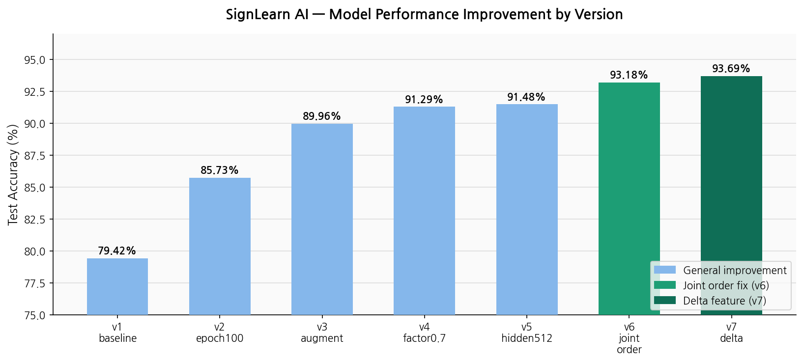
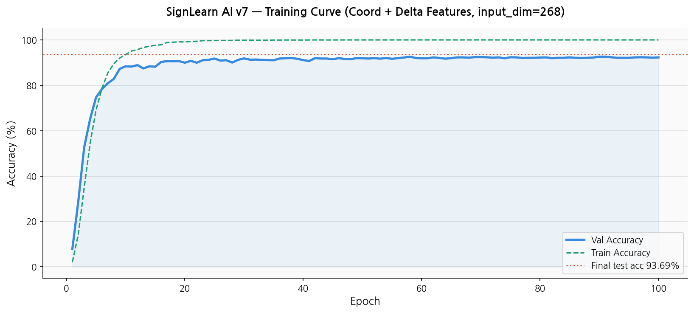
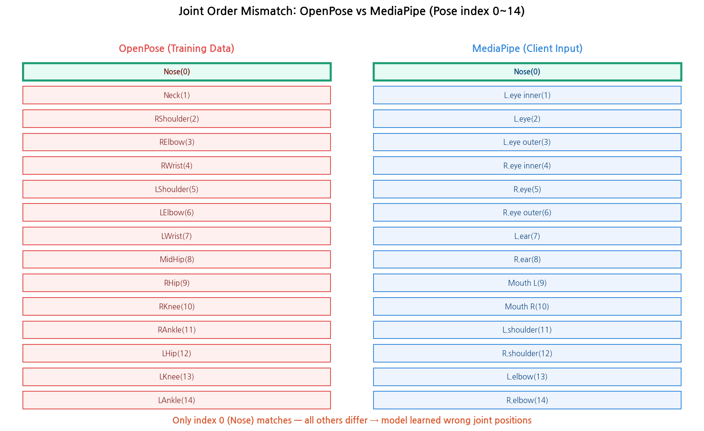
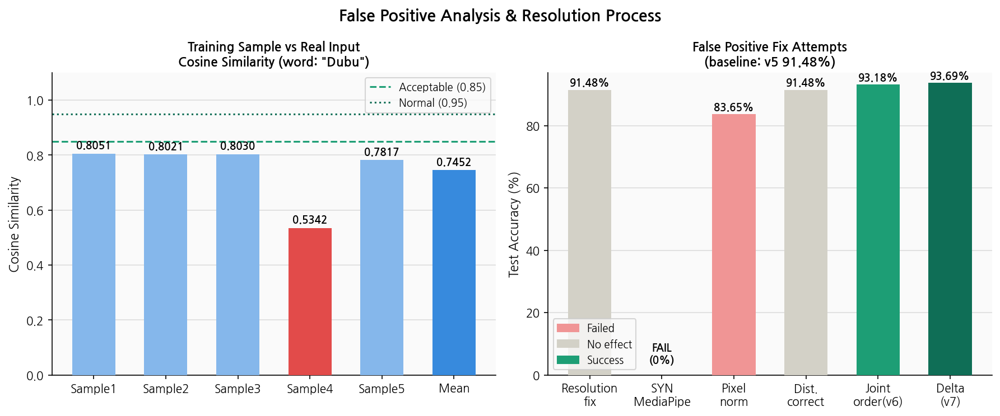
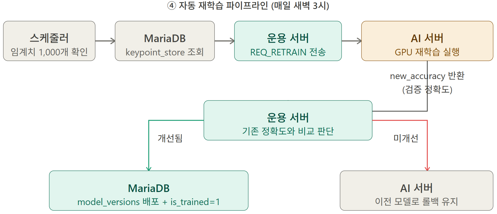

# 🤖 SignLearn AI 서버


> SignLearn 프로젝트의 AI 추론 서버.  
> 한국 수어 keypoint 시퀀스를 입력받아 1,000개 단어를 실시간 분류하고,  
> 사용자 데이터를 기반으로 자동 재학습하는 파이프라인을 포함합니다.

---

## 📁 파일 구조

```
ai_server/
├── ai_server.py          # TCP 9100 추론 서버 (메인)
├── model.py              # GRU / Transformer 모델 정의
├── train.py              # 모델 학습 스크립트
├── preprocess.py         # AI Hub 데이터 전처리 (OpenPose JSON → numpy)
├── retrain.py            # 자동 재학습 파이프라인 (DB 연동)
├── augment.py            # 데이터 증강 유틸리티
├── compare_keypoints.py  # 학습/추론 데이터 분포 유사도 분석 (오탐 원인 분석용)
├── .env                  # DB 접속 정보 (Git 제외)
├── .gitignore
├── data/
│   ├── models/
│   │   ├── best_model.pt       # 현재 서비스 중인 모델 (v7, test_acc 93.69%)
│   │   └── backup/             # 이전 버전 모델 백업
│   ├── processed/
│   │   ├── sequences.npy       # 전처리된 keypoint 시퀀스 (15,837개)
│   │   ├── label_indices.npy   # 클래스 인덱스 (0~999)
│   │   ├── labels.npy          # 단어명 배열
│   └── syn_단어목록.csv         # SYN 1,000단어 목록 (난이도 포함)
└── data/raw/                   # AI Hub 원본 데이터 (Git 제외)
```

---

## 🧠 모델

### GRU (현재 사용)

| 항목 | 값 |
|------|-----|
| 아키텍처 | Bidirectional GRU |
| 입력 차원 | 268 (좌표 134 + 차분 134) |
| Hidden dim | 512 |
| 레이어 수 | 3 |
| 분류 클래스 | 1,000단어 |
| Dropout | 0.4 |
| 최종 test accuracy | **93.69%** |

### 입력 형식

클라이언트가 MediaPipe로 추출한 keypoint를 픽셀값으로 변환 후 `/1920, /1080` 정규화.
관절 순서는 OpenPose 기준 학습 데이터를 MediaPipe 순서로 재배열하여 일치시킴.
동작 변화량 파악을 위해 좌표와 차분(프레임 간 변화량)을 합쳐 입력:

```
좌표: pose 25×2 + left_hand 21×2 + right_hand 21×2 = 134차원
차분: 직전 프레임 대비 변화량                       = 134차원
────────────────────────────────────────────────────
합계: 268차원
```

### Transformer 모델 (사용 안 함)

초기 설계 시 Transformer Encoder 기반 모델을 채택했으나, 단어당 16개 샘플로는 학습이 불가능(loss 6.907 고착)하여 GRU로 전환함.

---

## 📊 학습 과정 및 성능 개선

| 버전 | 변경 내용 | test_acc |
|------|-----------|---------|
| v1 | 원본만, dropout=0.3, epoch=50 | 79.42% |
| v2 | epoch=100 | 85.73% |
| v3 | 증강(×5배) + dropout=0.4 + factor=0.5 | 89.96% |
| v4 | 증강 + dropout=0.4 + factor=0.7 | 91.29% |
| v5 | 증강 + hidden_dim=512 + dropout=0.4 | 91.48% |
| v6 | pose 관절 순서 OpenPose→MediaPipe 매핑 | 93.18% |
| **v7** | 차분(delta) 추가 — 동작 변화량 학습 | **93.69%** |


### 시각화










### 데이터 증강 방법

원본 15,837개 → 증강 후 63,345개 (×5배)

| 방법 | 설명 |
|------|------|
| 노이즈 추가 (약) | std=0.01 가우시안 노이즈 |
| 노이즈 추가 (강) | std=0.02 가우시안 노이즈 |
| 속도 변환 (빠르게) | 1.25배속 (프레임 줄임) |
| 속도 변환 (느리게) | 0.75배속 (프레임 늘림) |

> **데이터 누수 방지**: 원본 기준으로 8:1:1 분리 후 train에만 증강 적용

---

## 🔌 통신 프로토콜

### 서버 정보

| 항목 | 값 |
|------|-----|
| HOST | 0.0.0.0 |
| PORT | 9100 |
| 통신 방식 | TCP (4바이트 헤더 + JSON 바디) |
| 연결 대상 | 운용서버 (10.10.10.114) |

### 요청 (NO.501 REQ_AI_INFER)

운용서버 → AI서버

```json
{
  "type": "REQ_AI_INFER",
  "request_id": "uuid-v4",
  "model_version_id": 1,
  "keypoint_version": "v1",
  "total_frames": 32,
  "frames": [
    {
      "frame_idx": 0,
      
      "pose":       [[x, y, visibility], ...],
      "left_hand":  [[x, y, z], ...],
      "right_hand": [[x, y, z], ...]
    }
  ]
}
```

### 응답 (NO.502 RES_AI_INFER)

AI서버 → 운용서버

```json
{
  "type": "RES_AI_INFER",
  "request_id": "uuid-v4",
  "predicted_word_id": 78,
  "confidence": 0.9148,
  "inference_ms": 15
}
```

> `predicted_word_id` = 모델 클래스 인덱스 + 1 (DB id 기준, 1~1000)

---

## 🔄 자동 재학습 파이프라인



```
keypoint_store (DB)
  ↓ is_trained=0 데이터 로드
신뢰도 필터링 (confidence < 0.5 버림)
  ↓
기존 모델 백업
  ↓
Fine-tuning (epoch=10, lr=1e-5)
  ↓
성능 비교
  ├── 향상 → 배포 (best_model.pt 교체)
  └── 하락 → 롤백 (기존 모델 유지)
  ↓
is_trained=1 마킹
```

### 재학습 기준 (FixMatch 참고)

| confidence | 처리 |
|------------|------|
| >= 0.8 | 정답 처리 + 재학습 사용 |
| 0.5 ~ 0.8 | 오답 처리 + 재학습 사용 |
| < 0.5 | 버림 |

---

## ⚙️ 실행 방법

### 환경 설정

```bash
cd ai_server
python3 -m venv venv
source venv/bin/activate
pip install -r requirements.txt
```

### .env 파일 설정

```env
DB_HOST=10.10.10.114
DB_PORT=3306
DB_USER=계정명
DB_PASSWORD=비밀번호
DB_NAME=ksl_learning
```

### 데이터 전처리

```bash
python3 preprocess.py
```

### 모델 학습

```bash
python3 train.py
```

### AI 서버 실행

```bash
python3 ai_server.py
```

### 재학습 파이프라인 실행

```bash
python3 retrain.py
```

---

## 🗂️ 데이터셋

- **출처**: AI Hub 한국 수어 영상 데이터셋 (dataSetSn=103)
- **종류**: REAL keypoint JSON (OpenPose 추출)
- **규모**: 1,000단어 × 16명 = 15,837개 샘플 (5프레임 미만 제외)
- **평균 프레임**: 53.6프레임/샘플
- **정규화**: x/1920, y/1080

### 난이도 분포

| 난이도 | 단어 수 |
|--------|--------|
| 초급 (1) | 140개 |
| 중급 (2) | 505개 |
| 고급 (3) | 355개 |

---

## 🛠️ 트러블슈팅

### 오탐 원인 분석 — OpenPose vs MediaPipe

학습 데이터(AI Hub OpenPose)와 실제 추론 입력(클라이언트 MediaPipe)의 좌표 추출 도구가 달라 오탐 발생.

`compare_keypoints.py`로 학습 샘플과 실제 입력 간 코사인 유사도를 측정한 결과 평균 **0.7452**로 낮게 나타남.

```
[두부] 학습 샘플 vs 테스트 keypoint 유사도
  학습 샘플 1: 0.8051
  학습 샘플 2: 0.8021
  학습 샘플 3: 0.8030
  학습 샘플 4: 0.5342
  학습 샘플 5: 0.7817
평균 유사도: 0.7452
→ 낮음 (OpenPose vs MediaPipe 분포 차이 가능성)
```

**해결 과정:**
1. 카메라 해상도 640×480 → 1920×1080 통일 → 효과 미미
2. 학습 데이터 통계 기반 분포 보정 시도 → 효과 미미
3. **pose 관절 순서 불일치 발견** — OpenPose(0:Nose, 1:Neck, 2:RShoulder...)와 MediaPipe(0:Nose, 1:Left eye inner, 2:Left eye...) 순서가 달라 모델이 엉뚱한 관절로 추론하고 있었음
4. OpenPose → MediaPipe 관절 순서 매핑 적용 후 재전처리 + 재학습 → **test_acc 91.48% → 93.18%**
5. 차분(프레임 간 변화량) 추가로 동작 패턴 학습 강화 → **93.69%**
6. 실제 서비스 테스트에서 정답 출력 확인

### Transformer 모델 학습 실패

데이터 부족(단어당 16개 샘플)으로 loss 6.907에서 수렴 불가 → GRU로 전환.

---

## 👤 담당

| 항목 | 내용 |
|------|------|
| 담당자 | 이지나 (팀장) |
| 역할 | AI 서버 전체 설계 및 구현 |
| 브랜치 | `ai` |
